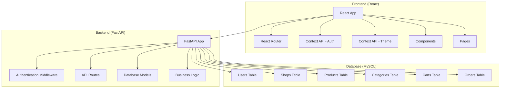

# Design Document

## Overview

The City Shops Platform is a full-stack web application consisting of a React frontend, FastAPI backend, and MySQL database. The system enables users to browse local shops and products, with role-based functionality for customers and shop owners. The architecture follows a clean separation of concerns with RESTful API design and responsive, accessible UI components.

## Architecture

### System Architecture



### Technology Stack

**Frontend:**
- React 18+ with functional components and hooks
- React Router v6 for navigation
- Context API for state management (auth, theme)
- CSS Modules or styled-components for styling
- Axios for API communication

**Backend:**
- FastAPI with Python 3.8+
- SQLAlchemy ORM for database operations
- Pydantic for data validation
- JWT for authentication
- CORS middleware for frontend communication

**Database:**
- MySQL 8.0+
- Connection via SQLAlchemy with mysql-connector-python

## Components and Interfaces

### Frontend Components

#### Core Layout Components
- **App.jsx**: Main application wrapper with routing
- **Navbar.jsx**: Navigation component with role-based menu items
- **Layout.jsx**: Common layout wrapper with header/footer
- **ThemeToggle.jsx**: Light/dark mode switcher

#### Page Components
- **HomePage.jsx**: Landing page with featured shops/products
- **ShopsPage.jsx**: Shop listing with category filters
- **ProductsPage.jsx**: Product listing with category filters
- **ShopDetailPage.jsx**: Individual shop details and products
- **ProductDetailPage.jsx**: Individual product details
- **CartPage.jsx**: Shopping cart management (customers only)
- **OrdersPage.jsx**: Order management (shop owners only)
- **LoginPage.jsx**: User authentication
- **SignupPage.jsx**: User registration
- **ProfilePage.jsx**: User profile management

#### Reusable Components
- **ShopCard.jsx**: Shop display card
- **ProductCard.jsx**: Product display card
- **CategoryFilter.jsx**: Category selection component
- **LoadingSpinner.jsx**: Loading state indicator
- **ErrorBoundary.jsx**: Error handling wrapper

### Backend API Endpoints

#### Authentication Endpoints
- `POST /auth/login` - User login
- `POST /auth/signup` - User registration
- `POST /auth/logout` - User logout
- `GET /auth/me` - Get current user info

#### Shop Endpoints
- `GET /shops` - List all shops with optional category filter
- `GET /shops/{shop_id}` - Get shop details
- `POST /shops` - Create new shop (shop owners only)
- `PUT /shops/{shop_id}` - Update shop (owner only)
- `DELETE /shops/{shop_id}` - Delete shop (owner only)

#### Product Endpoints
- `GET /products` - List all products with optional filters
- `GET /products/{product_id}` - Get product details
- `POST /products` - Create new product (shop owners only)
- `PUT /products/{product_id}` - Update product (owner only)
- `DELETE /products/{product_id}` - Delete product (owner only)

#### Cart Endpoints
- `GET /cart` - Get user's cart items
- `POST /cart/items` - Add item to cart
- `PUT /cart/items/{item_id}` - Update cart item quantity
- `DELETE /cart/items/{item_id}` - Remove item from cart
- `DELETE /cart` - Clear entire cart

#### Order Endpoints
- `POST /orders` - Create order from cart
- `GET /orders` - Get user's orders (customers) or shop's orders (owners)
- `PUT /orders/{order_id}` - Update order status (shop owners only)
- `GET /orders/{order_id}` - Get order details

#### Category Endpoints
- `GET /categories` - List all categories
- `POST /categories` - Create new category (admin only)

## Data Models

### Database Schema

#### Users Table
```sql
CREATE TABLE users (
    id INT PRIMARY KEY AUTO_INCREMENT,
    email VARCHAR(255) UNIQUE NOT NULL,
    username VARCHAR(100) UNIQUE NOT NULL,
    password_hash VARCHAR(255) NOT NULL,
    role ENUM('customer', 'shop_owner') NOT NULL,
    first_name VARCHAR(100),
    last_name VARCHAR(100),
    phone VARCHAR(20),
    address TEXT,
    created_at TIMESTAMP DEFAULT CURRENT_TIMESTAMP,
    updated_at TIMESTAMP DEFAULT CURRENT_TIMESTAMP ON UPDATE CURRENT_TIMESTAMP
);
```

#### Categories Table
```sql
CREATE TABLE categories (
    id INT PRIMARY KEY AUTO_INCREMENT,
    name VARCHAR(100) UNIQUE NOT NULL,
    description TEXT,
    created_at TIMESTAMP DEFAULT CURRENT_TIMESTAMP
);
```

#### Shops Table
```sql
CREATE TABLE shops (
    id INT PRIMARY KEY AUTO_INCREMENT,
    owner_id INT NOT NULL,
    name VARCHAR(200) NOT NULL,
    description TEXT,
    category_id INT NOT NULL,
    address TEXT NOT NULL,
    phone VARCHAR(20),
    email VARCHAR(255),
    image_url VARCHAR(500),
    is_active BOOLEAN DEFAULT TRUE,
    created_at TIMESTAMP DEFAULT CURRENT_TIMESTAMP,
    updated_at TIMESTAMP DEFAULT CURRENT_TIMESTAMP ON UPDATE CURRENT_TIMESTAMP,
    FOREIGN KEY (owner_id) REFERENCES users(id) ON DELETE CASCADE,
    FOREIGN KEY (category_id) REFERENCES categories(id)
);
```

#### Products Table
```sql
CREATE TABLE products (
    id INT PRIMARY KEY AUTO_INCREMENT,
    shop_id INT NOT NULL,
    name VARCHAR(200) NOT NULL,
    description TEXT,
    price DECIMAL(10, 2) NOT NULL,
    category_id INT NOT NULL,
    image_url VARCHAR(500),
    stock_quantity INT DEFAULT 0,
    is_available BOOLEAN DEFAULT TRUE,
    created_at TIMESTAMP DEFAULT CURRENT_TIMESTAMP,
    updated_at TIMESTAMP DEFAULT CURRENT_TIMESTAMP ON UPDATE CURRENT_TIMESTAMP,
    FOREIGN KEY (shop_id) REFERENCES shops(id) ON DELETE CASCADE,
    FOREIGN KEY (category_id) REFERENCES categories(id)
);
```

#### Carts Table
```sql
CREATE TABLE carts (
    id INT PRIMARY KEY AUTO_INCREMENT,
    user_id INT NOT NULL,
    product_id INT NOT NULL,
    quantity INT NOT NULL DEFAULT 1,
    created_at TIMESTAMP DEFAULT CURRENT_TIMESTAMP,
    updated_at TIMESTAMP DEFAULT CURRENT_TIMESTAMP ON UPDATE CURRENT_TIMESTAMP,
    FOREIGN KEY (user_id) REFERENCES users(id) ON DELETE CASCADE,
    FOREIGN KEY (product_id) REFERENCES products(id) ON DELETE CASCADE,
    UNIQUE KEY unique_user_product (user_id, product_id)
);
```

#### Orders Table
```sql
CREATE TABLE orders (
    id INT PRIMARY KEY AUTO_INCREMENT,
    customer_id INT NOT NULL,
    shop_id INT NOT NULL,
    total_amount DECIMAL(10, 2) NOT NULL,
    status ENUM('pending', 'confirmed', 'preparing', 'ready', 'delivered', 'cancelled') DEFAULT 'pending',
    delivery_address TEXT NOT NULL,
    notes TEXT,
    created_at TIMESTAMP DEFAULT CURRENT_TIMESTAMP,
    updated_at TIMESTAMP DEFAULT CURRENT_TIMESTAMP ON UPDATE CURRENT_TIMESTAMP,
    FOREIGN KEY (customer_id) REFERENCES users(id) ON DELETE CASCADE,
    FOREIGN KEY (shop_id) REFERENCES shops(id) ON DELETE CASCADE
);
```

#### Order Items Table
```sql
CREATE TABLE order_items (
    id INT PRIMARY KEY AUTO_INCREMENT,
    order_id INT NOT NULL,
    product_id INT NOT NULL,
    quantity INT NOT NULL,
    price DECIMAL(10, 2) NOT NULL,
    FOREIGN KEY (order_id) REFERENCES orders(id) ON DELETE CASCADE,
    FOREIGN KEY (product_id) REFERENCES products(id)
);
```

### Pydantic Models (Backend)

#### User Models
```python
class UserBase(BaseModel):
    email: str
    username: str
    role: str
    first_name: Optional[str] = None
    last_name: Optional[str] = None

class UserCreate(UserBase):
    password: str

class UserResponse(UserBase):
    id: int
    created_at: datetime
```

#### Shop Models
```python
class ShopBase(BaseModel):
    name: str
    description: Optional[str] = None
    category_id: int
    address: str
    phone: Optional[str] = None
    email: Optional[str] = None

class ShopCreate(ShopBase):
    pass

class ShopResponse(ShopBase):
    id: int
    owner_id: int
    is_active: bool
    created_at: datetime
```

## Error Handling

### Frontend Error Handling
- **Error Boundaries**: Catch and display React component errors gracefully
- **API Error Handling**: Centralized error handling for API requests with user-friendly messages
- **Form Validation**: Client-side validation with clear error messages
- **Loading States**: Show loading indicators during API calls
- **Retry Mechanisms**: Allow users to retry failed operations

### Backend Error Handling
- **HTTP Status Codes**: Proper status codes for different error types (400, 401, 403, 404, 500)
- **Error Response Format**: Consistent error response structure with error codes and messages
- **Validation Errors**: Detailed validation error messages using Pydantic
- **Database Errors**: Handle connection issues and constraint violations
- **Authentication Errors**: Clear messages for login/authorization failures

### Error Response Format
```json
{
    "error": {
        "code": "VALIDATION_ERROR",
        "message": "Invalid input data",
        "details": {
            "field": "email",
            "issue": "Email format is invalid"
        }
    }
}
```

## Testing Strategy

### Frontend Testing
- **Unit Tests**: Jest and React Testing Library for component testing
- **Integration Tests**: Test component interactions and API integration
- **E2E Tests**: Cypress for critical user flows (login, shopping, ordering)
- **Accessibility Tests**: Automated accessibility testing with jest-axe

### Backend Testing
- **Unit Tests**: pytest for individual function testing
- **Integration Tests**: Test API endpoints with test database
- **Database Tests**: Test database operations and migrations
- **Authentication Tests**: Test JWT token handling and role-based access

### Test Coverage Goals
- Frontend: 80% code coverage minimum
- Backend: 90% code coverage minimum
- Critical paths: 100% coverage (authentication, payment, order processing)

### Testing Environment
- **Test Database**: Separate MySQL instance for testing
- **Mock Data**: Fixtures for consistent test data
- **CI/CD Integration**: Automated testing on code commits
- **Performance Testing**: Load testing for API endpoints